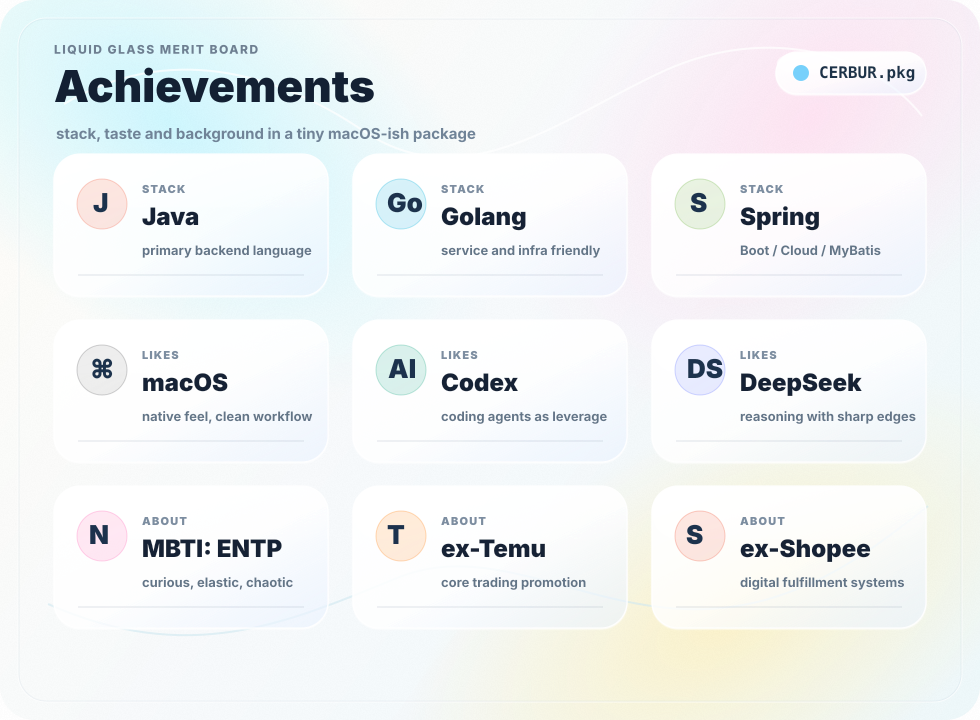

## BACKEND!!!!!! SYSTEMS!!!!!! CHAOS BUT STRUCTURED!!!!!!

  

## About

- Java backend engineer, previously working on Temu core trading / promotion systems.
- Built promotion, campaign, product-selection and virtual fulfillment systems in e-commerce scenarios.
- Care about high-concurrency systems, cache architecture, event-driven design and reliability.
- ENTP: curious, fast-iterating, question-first, occasionally over-engineering for fun.
- Currently sharpening Java fundamentals, system design, LeetCode and AI Agent / LLM application engineering.

## Things I Care About

- Keeping core trading paths stable under real traffic.
- Turning messy business rules into reusable system capabilities.
- Cache design, hot key handling, async decoupling and eventual consistency.
- Building systems where complexity stays inside the right boundary.

## Channel

## Now

- Looking deeper into backend architecture, distributed systems and AI-native developer tools.
- Ask me about Java backend, e-commerce promotion systems, caching, MQ, HBase / ES / Flink pipelines.
- Fun fact: I like systems that look chaotic from outside but become very explainable once modeled properly.
